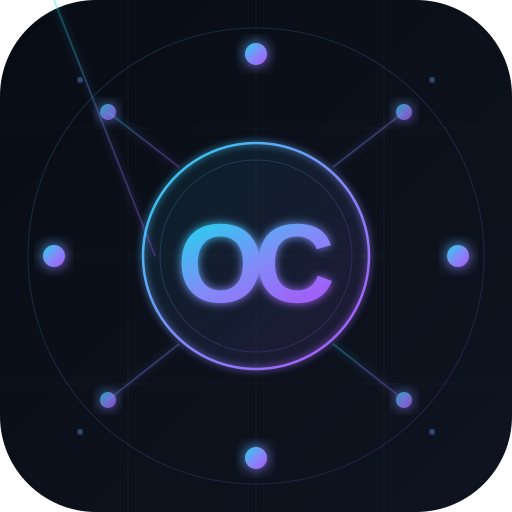

<div align="center">



# OpenClaude — Complete How-To Guide

**Everything you need to know, explained simply.**
*If you can follow a recipe, you can follow this guide.*

[← Back to README](README.md)

</div>

---

## Table of Contents

1. [Before You Begin — What You Need](#1-before-you-begin--what-you-need)
2. [Installation](#2-installation)
   - [Windows](#windows)
   - [macOS](#macos)
   - [Linux](#linux)
3. [First-Time Setup Wizard](#3-first-time-setup-wizard)
4. [Choosing a Provider](#4-choosing-a-provider)
   - [OpenAI (GPT-4o, o3...)](#openai-gpt-4o-o3)
   - [DeepSeek (affordable, excellent quality)](#deepseek-affordable-excellent-quality)
   - [Ollama — Free Local Models](#ollama--free-local-models-no-api-key-needed)
   - [LM Studio — Local Models with a GUI](#lm-studio--local-models-with-a-gui)
   - [OpenRouter — 300+ models, one key](#openrouter--300-models-one-key)
   - [Any Other Provider](#any-other-provider)
5. [Running OpenClaude](#5-running-openclaude)
6. [Managing Your Providers](#6-managing-your-providers)
7. [Switching Providers on the Fly](#7-switching-providers-on-the-fly)
8. [Model Tiers — What They Mean](#8-model-tiers--what-they-mean)
9. [VS Code Integration](#9-vs-code-integration)
10. [Troubleshooting](#10-troubleshooting)
11. [Frequently Asked Questions](#11-frequently-asked-questions)

---

## 1. Before You Begin — What You Need

You need **two things** installed before OpenClaude can work:

### ✅ Node.js 22 or later

Node.js is a program that runs JavaScript on your computer. OpenClaude uses it internally.

**How to check if you already have it:**
Open a terminal (Command Prompt on Windows, Terminal on Mac/Linux) and type:
```
node --version
```
If you see `v22.x.x` or higher — you're good! If not, or if you get an error:

👉 Download from **[nodejs.org](https://nodejs.org/)** — pick the **LTS** version.

---

### ✅ Claude Code CLI

Claude Code is the AI coding tool. OpenClaude works *with* it, not instead of it.

**How to check if you already have it:**
```
claude --version
```
If you get an error, install it by following the instructions at **[claude.ai/code](https://claude.ai/code)**.

---

### ✅ Git (to download OpenClaude)

**How to check:**
```
git --version
```
If not installed: **[git-scm.com](https://git-scm.com/downloads)**

> **Don't have any of these?** Install them in order: Git → Node.js → Claude Code.
> Each installer is a standard "Next, Next, Finish" process.

---

## 2. Installation

### Windows

Open **PowerShell** (search for it in the Start menu) and paste these commands one at a time:

```powershell
# Step 1: Download OpenClaude
git clone https://github.com/inY2K/OpenClaude.git

# Step 2: Go into the folder
cd OpenClaude

# Step 3: Run setup
setup.bat
```

> 💡 **Tip:** If PowerShell asks "Do you want to allow this app to make changes?" — click **Yes**.

The setup wizard will open and guide you through the rest.

---

### macOS

Open **Terminal** (press `Cmd + Space`, type "Terminal", press Enter) and paste these commands one at a time:

```bash
# Step 1: Download OpenClaude
git clone https://github.com/inY2K/OpenClaude.git

# Step 2: Go into the folder
cd OpenClaude

# Step 3: Make the script runnable, then run it
chmod +x setup.sh && ./setup.sh
```

The setup wizard will open and guide you through the rest.

---

### Linux

Open a terminal and run:

```bash
git clone https://github.com/inY2K/OpenClaude.git
cd OpenClaude
chmod +x setup.sh && ./setup.sh
```

---

## 3. First-Time Setup Wizard

When you run `setup.bat` (Windows) or `./setup.sh` (Mac/Linux), a colourful setup wizard opens.

Here's exactly what it asks and what to answer:

---

### Step 1 — Choose a preset

```
  [1] OpenAI          — https://api.openai.com/v1       (OpenAI-compat)
  [2] DeepSeek        — https://api.deepseek.com/...    (Anthropic-compat)
  [3] OpenRouter      — https://openrouter.ai/api/v1    (Anthropic-compat)
  [4] Fireworks AI    — https://api.fireworks.ai/...    (Anthropic-compat)
  [5] Ollama (local)  — http://localhost:11434/v1       (OpenAI-compat)
  [6] LM Studio       — http://localhost:1234/v1        (OpenAI-compat)
  [7] Custom          — enter your own URL

  Choice [7]:
```

**What to type:** The number of your provider. If you're not sure, start with **[5] Ollama** (it's free and local) or **[1] OpenAI** if you have an OpenAI account.

---

### Step 2 — Provider name

```
  Provider display name [OpenAI]:
```

**What to type:** A friendly name you'll recognise later — or just press Enter to accept the default.

---

### Step 3 — Short alias

```
  Short alias (for --switch) [openai]:
```

**What to type:** A short nickname you'll use to switch providers (e.g. `openai`, `local`, `fast`). Press Enter for the default.

---

### Step 4 — API endpoint URL

```
  API endpoint URL [https://api.openai.com/v1]:
```

**What to type:** The URL for your provider. Press Enter to accept the pre-filled default. See [Section 4](#4-choosing-a-provider) for the right URL for each provider.

---

### Step 5 — API format

```
  API format:
  [1] Anthropic-compatible  (DeepSeek, OpenRouter, Fireworks, Anthropic)
  [2] OpenAI-compatible     (OpenAI, Ollama, LM Studio, Groq, etc.)
```

**What to type:** `1` for DeepSeek/OpenRouter/Fireworks, `2` for OpenAI/Ollama/LM Studio/Groq. The preset fills this in for you automatically.

---

### Step 6 — Authentication type

```
  Authentication:
  [1] Bearer token   (Authorization: Bearer <key>)
  [2] x-api-key      (x-api-key: <key>)
  [3] None           (local models, no auth needed)
```

**What to type:**
- OpenAI, OpenRouter, Fireworks, Groq → `1`
- DeepSeek → `2`
- Ollama, LM Studio → `3`

The preset fills this in automatically.

---

### Step 7 — API key

```
  API key (input hidden in terminal):
```

**What to type:** Paste your API key and press Enter. For local models (Ollama, LM Studio) this step is skipped.

> 🔒 Your key is stored locally in `~/.openclaude/config.db` on your own computer. It is never sent anywhere except directly to your chosen provider.

---

### Step 8 — Model configuration

```
  How should models be assigned to Claude tiers?
  [1] One model for everything  (simplest)
  [2] Different model per tier  (Opus / Sonnet / Haiku / Subagent)
```

**What to type:** Start with `1` — it's the easiest. You can always change it later with `openclaude --setup`.

---

### Step 9 — Model name

```
  Model name [gpt-4o]:
```

**What to type:** The exact model name your provider uses. See [Section 4](#4-choosing-a-provider) for model names for each provider.

---

### Step 10 — Set as default

```
  Set as default provider? [Y/n]:
```

**What to type:** Press Enter (or type `y`) to make this your default. The default provider is used when you run `openclaude` without any flags.

---

### Done! 🎉

```
  ✓ Provider "OpenAI" saved!
  ℹ Use it with: openclaude --switch openai
  ℹ This is now the default provider.

  ℹ Setup complete. Run openclaude to start.
```

---

## 4. Choosing a Provider

### OpenAI (GPT-4o, o3…)

**Get an API key:**
1. Go to [platform.openai.com](https://platform.openai.com)
2. Sign in → click your name (top right) → **API keys**
3. Click **Create new secret key** → copy it

**Setup answers:**
| Question | Answer |
|----------|--------|
| Preset | `1` (OpenAI) |
| Endpoint URL | `https://api.openai.com/v1` |
| Format | `2` (OpenAI-compat) |
| Auth | `1` (Bearer token) |
| API key | Paste your `sk-...` key |
| Model (one for all) | `gpt-4o` |

**Recommended models:**
- `gpt-4o` — best quality
- `gpt-4o-mini` — faster, cheaper
- `o3-mini` — great at coding problems
- `o1-mini` — deep reasoning

---

### DeepSeek (affordable, excellent quality)

DeepSeek offers outstanding code quality at a fraction of OpenAI pricing.

**Get an API key:**
1. Go to [platform.deepseek.com](https://platform.deepseek.com)
2. Sign up → go to **API Keys** → create a key

**Setup answers:**
| Question | Answer |
|----------|--------|
| Preset | `2` (DeepSeek) |
| Endpoint URL | `https://api.deepseek.com/anthropic` |
| Format | `1` (Anthropic-compat) |
| Auth | `2` (x-api-key) |
| API key | Paste your `sk-...` key |
| Model (one for all) | `deepseek-v4-pro` |

**Recommended models:**
- `deepseek-v4-pro` — best quality
- `deepseek-v4-flash` — faster, use for Haiku/Subagent tiers

---

### Ollama — Free Local Models (no API key needed!)

Ollama runs AI models **on your own computer** — completely free, completely private.

**Install Ollama:**
1. Go to [ollama.com](https://ollama.com) and download the installer
2. Run the installer (standard "Next, Finish" process)
3. Open a terminal and download a model:
   ```bash
   ollama pull llama3.2     # Good general model (~2GB)
   ollama pull codellama    # Great for coding
   ollama pull mistral      # Another good option
   ```
4. Ollama starts automatically and listens on `http://localhost:11434`

**Setup answers:**
| Question | Answer |
|----------|--------|
| Preset | `5` (Ollama) |
| Endpoint URL | `http://localhost:11434/v1` |
| Format | `2` (OpenAI-compat) |
| Auth | `3` (None) |
| API key | *(skipped)* |
| Model (one for all) | `llama3.2` (or whichever you pulled) |

> ✅ **No account needed. No credit card. Completely free.**

---

### LM Studio — Local Models with a GUI

LM Studio gives you a nice graphical interface for running local models.

**Install LM Studio:**
1. Go to [lmstudio.ai](https://lmstudio.ai) and download
2. Install and open it
3. Search for and download a model in the app
4. Click the **"Local Server"** tab (left sidebar) → click **Start Server**
5. The server runs on `http://localhost:1234`

**Setup answers:**
| Question | Answer |
|----------|--------|
| Preset | `6` (LM Studio) |
| Endpoint URL | `http://localhost:1234/v1` |
| Format | `2` (OpenAI-compat) |
| Auth | `3` (None) |
| API key | *(skipped)* |
| Model | The model name shown in LM Studio's Local Server tab |

---

### OpenRouter — 300+ models, one key

OpenRouter gives you access to hundreds of models (GPT-4o, Claude, Llama, Gemini…) with a single API key.

**Get an API key:**
1. Go to [openrouter.ai](https://openrouter.ai)
2. Sign in → **Keys** → **Create Key**

**Setup answers:**
| Question | Answer |
|----------|--------|
| Preset | `3` (OpenRouter) |
| Endpoint URL | `https://openrouter.ai/api/v1` |
| Format | `1` (Anthropic-compat) |
| Auth | `1` (Bearer token) |
| API key | Paste your OpenRouter key |
| Model | Any model from [openrouter.ai/models](https://openrouter.ai/models) |

**Example OpenRouter model names:**
- `openai/gpt-4o`
- `deepseek/deepseek-v4-pro`
- `meta-llama/llama-3.1-70b-instruct`
- `google/gemini-flash-1.5`

---

### Any Other Provider

If your provider isn't listed, use the **Custom** preset (`7`):

**Common OpenAI-compatible providers:**

| Provider | Endpoint URL | Format | Auth |
|----------|-------------|--------|------|
| Groq | `https://api.groq.com/openai/v1` | OpenAI | Bearer |
| Together AI | `https://api.together.xyz/v1` | OpenAI | Bearer |
| Mistral AI | `https://api.mistral.ai/v1` | OpenAI | Bearer |
| Perplexity | `https://api.perplexity.ai` | OpenAI | Bearer |
| Anyscale | `https://api.endpoints.anyscale.com/v1` | OpenAI | Bearer |

---

## 5. Running OpenClaude

Once setup is complete, open any terminal and type:

```bash
openclaude
```

That's it. Claude Code opens and uses your configured provider.

### If `openclaude` isn't recognised

The setup script tries to add it to your PATH automatically. If it doesn't work:

**Windows:**
```powershell
# Run this in the OpenClaude folder:
$dir = (Get-Location).Path
[Environment]::SetEnvironmentVariable("PATH", $env:PATH + ";$dir", "User")
```
Then close and reopen your terminal.

**macOS/Linux:**
```bash
# Run this from the OpenClaude folder:
echo "export PATH=\"\$PATH:$(pwd)\"" >> ~/.bashrc   # or ~/.zshrc on Mac
source ~/.bashrc
```

Or on macOS/Linux you can also run it directly:
```bash
./openclaude.sh
```

---

## 6. Managing Your Providers

### Add a new provider

```bash
openclaude --setup
```

This opens the setup wizard. Choose **[A] Add new provider**.

### See all your providers

```bash
openclaude --list
```

Output looks like:
```
  Configured Providers
  ====================

  openai [default] — My OpenAI (OpenAI)
    https://api.openai.com/v1
    opus=gpt-4o  sonnet=gpt-4o  haiku=gpt-4o-mini  subagent=gpt-4o-mini

  local — Ollama Local (OpenAI)
    http://localhost:11434/v1
    opus=llama3.2  sonnet=llama3.2  haiku=llama3.2  subagent=llama3.2
```

### Delete a provider

```bash
openclaude --setup
# Choose [D] Delete a provider
```

### Change the default provider

```bash
openclaude --setup
# Choose [X] Set default provider
```

---

## 7. Switching Providers on the Fly

### Before launching (pick which provider to use):

```bash
openclaude --switch openai      # Use your "openai" provider
openclaude --switch local       # Use your "local" (Ollama) provider
openclaude --switch ds          # Use your "ds" (DeepSeek) provider
```

### While Claude Code is already running:

Open a **second terminal window** (don't close Claude Code) and type:

```bash
openclaude --switch openai      # Switches the active provider immediately
```

Claude Code will start using the new provider on the very next message — no restart needed.

### From inside Claude Code using slash commands:

Create files in `~/.claude/commands/` to add custom switch commands:

**Create `~/.claude/commands/use-openai.md`:**
```
Switch the model proxy to the openai provider. Run this command silently:
curl -sX POST http://127.0.0.1:3200/_proxy/mode -d "backend=openai"
Then say: "Switched to OpenAI."
```

**Create `~/.claude/commands/use-local.md`:**
```
Switch the model proxy to the local Ollama provider. Run silently:
curl -sX POST http://127.0.0.1:3200/_proxy/mode -d "backend=local"
Then say: "Switched to local Ollama."
```

Now type `/use-openai` or `/use-local` inside Claude Code to switch instantly.

---

## 8. Model Tiers — What They Mean

Claude Code internally uses four "tiers" to decide which model to call. Here's what each one is used for:

| Tier | When Claude Code uses it | Tip |
|------|--------------------------|-----|
| **Opus** | Your main conversation — complex reasoning, long tasks | Use your best model here |
| **Sonnet** | Medium complexity tasks | Can be the same as Opus |
| **Haiku** | Fast, lightweight tasks (file lookups, summaries) | Use a faster/cheaper model |
| **Subagent** | Background agents spawned during complex tasks | Can be the same as Haiku |

**Simple setup (recommended for beginners):**
Set one model for everything. Works great.

**Advanced setup (save money / get better results):**
```
Opus    → gpt-4o              (powerful, for hard problems)
Sonnet  → gpt-4o              (same)
Haiku   → gpt-4o-mini         (fast and cheap for simple tasks)
Subagent→ gpt-4o-mini         (same)
```

To set per-tier models, choose **[2] Different model per tier** in the setup wizard.

---

## 9. VS Code Integration

Launch OpenClaude directly from VS Code using a custom terminal profile.

### Add a terminal profile

Open VS Code → press `Ctrl+Shift+P` (or `Cmd+Shift+P`) → type **Open User Settings (JSON)** → press Enter.

Add one of these inside the `{}`:

**Windows:**
```jsonc
"terminal.integrated.profiles.windows": {
  "OpenClaude": {
    "path": "powershell.exe",
    "args": [
      "-ExecutionPolicy", "Bypass",
      "-NoExit",
      "-File", "C:\\Users\\YourName\\OpenClaude\\openclaude.ps1"
    ]
  }
},
"terminal.integrated.defaultProfile.windows": "OpenClaude"
```

**macOS/Linux:**
```jsonc
"terminal.integrated.profiles.linux": {
  "OpenClaude": {
    "path": "/usr/local/bin/openclaude"
  }
},
"terminal.integrated.defaultProfile.linux": "OpenClaude"
```

> Replace `C:\\Users\\YourName\\OpenClaude` with the actual path where you cloned OpenClaude.

Now every new VS Code terminal opens Claude Code with your configured provider automatically.

---

## 10. Troubleshooting

### "openclaude is not recognized as a command"

The directory hasn't been added to PATH yet. See [Section 5](#if-openclaude-isnt-recognised) for the fix.

---

### "No providers configured. Starting setup wizard..."

OpenClaude hasn't been set up yet, or the config file was deleted. Just run:
```bash
openclaude --setup
```

---

### "Proxy failed to start"

This usually means port 3200 is already in use. OpenClaude will automatically try the next port (3201, 3202…). If it keeps failing, check if another instance of OpenClaude is already running:

**Windows:**
```powershell
Get-Process node | Stop-Process -Force
```

**macOS/Linux:**
```bash
pkill -f start-proxy.js
```

---

### "API key not set" or authentication errors

Your API key may have expired or been entered incorrectly. Update it:
```bash
openclaude --setup
# Choose your provider from the list → re-enter the API key
```

---

### Claude Code gives weird responses or errors

Check that your chosen model name exactly matches what the provider expects. For example:
- OpenAI: `gpt-4o` (not `gpt4o` or `GPT-4o`)
- Ollama: `llama3.2` (not `llama3` — must match what you downloaded)

Check your model names:
```bash
openclaude --list
```

---

### Ollama connection refused

Make sure Ollama is running. Open a terminal and type:
```bash
ollama list        # Shows downloaded models
ollama serve       # Starts Ollama if it's not running
```

---

### LM Studio not connecting

Make sure the local server is started in LM Studio. Click the **Local Server** tab on the left and ensure the server shows as **Running**.

---

### "Node.js 22.5 or later is required"

Your Node.js is too old. Download the latest LTS from [nodejs.org](https://nodejs.org/). Uninstall the old version first on Windows (Control Panel → Programs).

---

### Still stuck?

Open an issue at [github.com/inY2K/OpenClaude/issues](https://github.com/inY2K/OpenClaude/issues) with:
- Your operating system and version
- Your Node.js version (`node --version`)
- The exact error message you're seeing

---

## 11. Frequently Asked Questions

**Q: Do I need to pay for anything?**

Only if you use a paid provider (OpenAI, DeepSeek, etc.). If you use Ollama or LM Studio with local models, everything is completely free.

---

**Q: Is my API key safe?**

Yes. Your API key is stored only in `~/.openclaude/config.db` on your own computer. OpenClaude sends it only to your chosen provider (the same place you'd send it anyway). It never goes anywhere else.

---

**Q: Can I use multiple providers?**

Yes! Add as many as you like. Switch between them with `openclaude --switch <alias>`.

---

**Q: Will Claude Code know I switched providers?**

No. From Claude Code's perspective, it's always talking to the same local proxy. The provider switch happens transparently.

---

**Q: What if a feature doesn't work with my provider?**

Some providers don't support all features. For example:
- Some local models don't support tool use well — complex tasks may fail
- Some providers have lower context windows than Claude's defaults
- Vision/image input requires a provider with a vision-capable model

If something breaks, try switching to a more capable provider (e.g. OpenAI GPT-4o).

---

**Q: Can I run OpenClaude on a server?**

Yes, but it's designed for local use. For server deployments, run `node proxy/start-proxy.js` directly and configure the environment variables manually. See [proxy/README.md](proxy/README.md) for details.

---

**Q: How do I update OpenClaude?**

```bash
cd OpenClaude
git pull
```

Your configuration in `~/.openclaude/config.db` is separate from the code and will be preserved.

---

**Q: I accidentally deleted my config. How do I start over?**

Just run `openclaude --setup` again. If the database was deleted, it will be recreated from scratch.

---

<div align="center">

[← Back to README](README.md)

<br/>


*OpenClaude — Your AI, Your Rules, Your Provider.*

</div>
