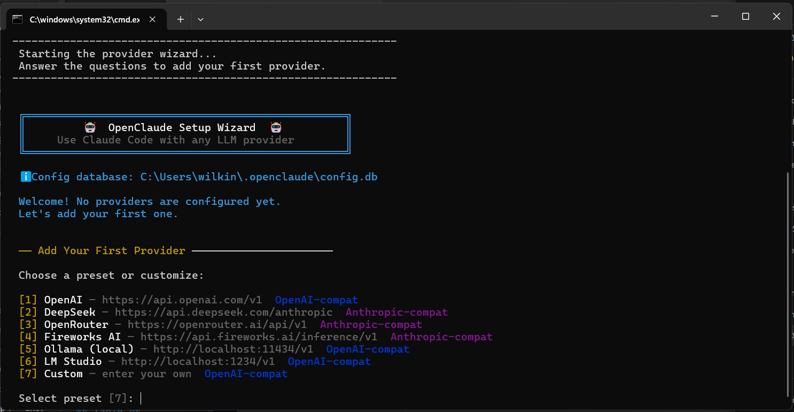
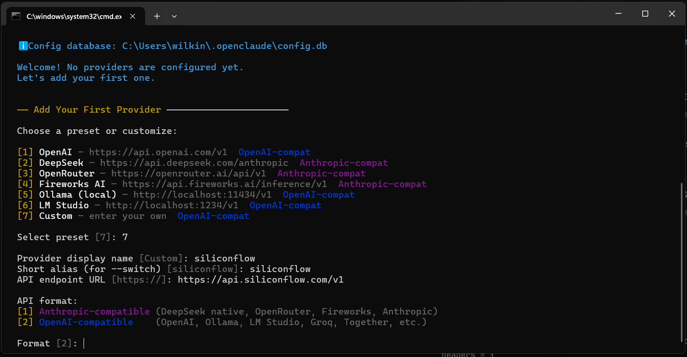
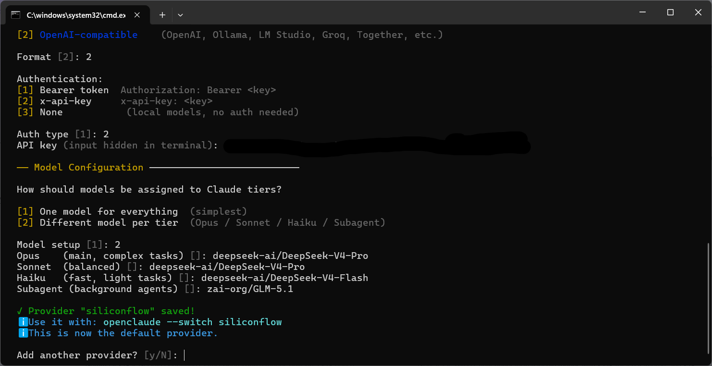
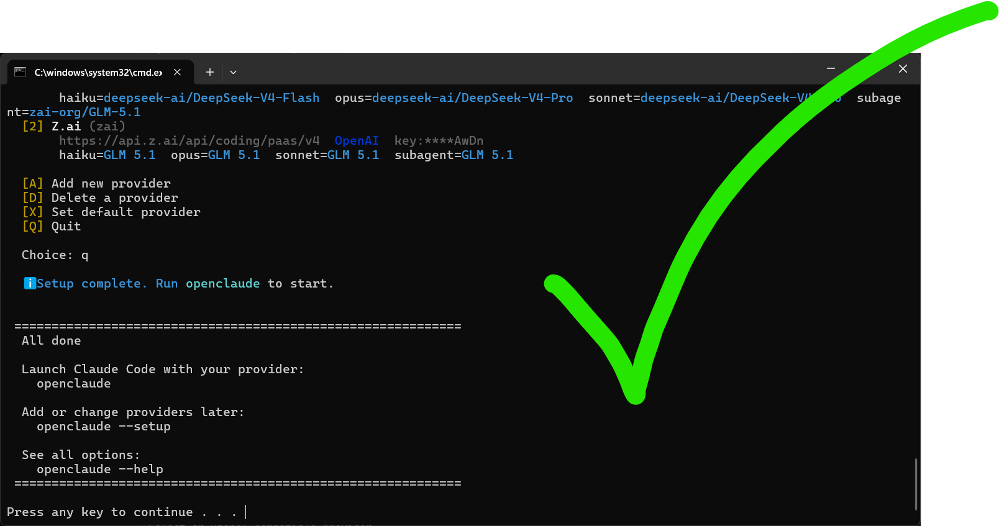
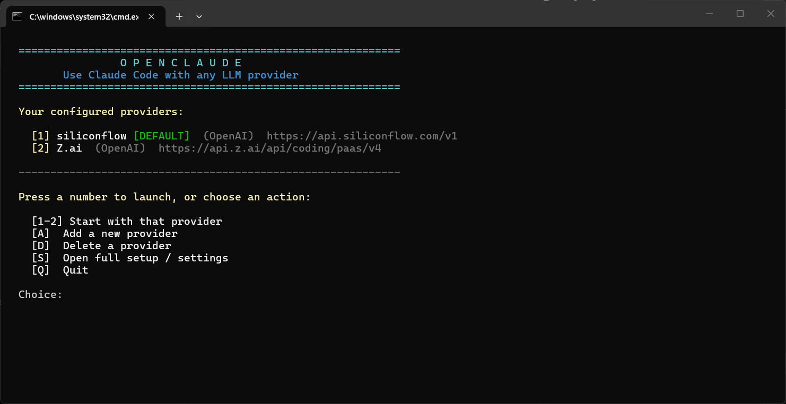

<div align="center">

<a href="https://iny2k.github.io/OpenClaude/">
  
</a>

<br/><br/>

[](https://nodejs.org/)
[](LICENSE)
[](HOW_TO.md)
[](#-zero-dependencies)
[](https://iny2k.github.io/OpenClaude/)

<br/>

### Use Claude Code with **any** LLM provider — OpenAI, DeepSeek, Ollama, Groq, or your own server.
### Beautiful guided setup. No technical knowledge required.

<br/>

[**📖 Step-by-Step Guide**](HOW_TO.md) &nbsp;·&nbsp; [**⚡ Quick Start**](#-quick-start) &nbsp;·&nbsp; [**🌐 Providers**](#-supported-providers) &nbsp;·&nbsp; [**🔧 How It Works**](#-how-it-works) &nbsp;·&nbsp; [**🩺 Troubleshooting**](TROUBLESHOOTING.md)

<br/>

</div>

---

## 💡 What is OpenClaude?

[Claude Code](https://claude.ai/code) is Anthropic's AI coding assistant. It's incredibly powerful — but it only talks to Anthropic's own API by default.

**OpenClaude changes that.** It's an intelligent local proxy that sits between Claude Code and *any* LLM provider you choose, translating API formats automatically in real time.

```
  ┌──────────────────┐     ┌──────────────────────────────┐     ┌───────────────────────┐
  │                  │     │                              │     │                       │
  │   Claude Code    │────▶│      OpenClaude Proxy        │────▶│   Your LLM Provider   │
  │   (unchanged)    │◀────│   Translates & routes APIs   │◀────│  (any compatible API) │
  │                  │     │                              │     │                       │
  └──────────────────┘     └──────────────────────────────┘     └───────────────────────┘
```

Your Claude Code experience stays **exactly the same**. You just choose which brain powers it.

---

## ⚡ Quick Start

> Takes about **2 minutes**. No technical knowledge required.

<details open>
<summary><b>🪟 Windows</b></summary>

```batch
git clone https://github.com/inY2K/OpenClaude.git
cd OpenClaude
StartOpenClaude.bat
```

The setup wizard opens automatically and walks you through everything.
After setup, just type `openclaude` in any terminal to launch.

</details>

<details open>
<summary><b>🍎 macOS / 🐧 Linux</b></summary>

```bash
git clone https://github.com/inY2K/OpenClaude.git
cd OpenClaude
chmod +x StartOpenClaude.sh && ./StartOpenClaude.sh
```

The setup wizard opens automatically and walks you through everything.
After setup, just type `openclaude` in any terminal to launch.

</details>

> 📖 **Need more detail?** The [**HOW_TO.md**](HOW_TO.md) guide covers every step, every provider, and every common question — with clear screenshots descriptions.

---

## 🖼️ Screenshots

<table>
<tr>
<td align="center" width="50%">

**Welcome Screen**



*The main menu — launch, manage providers, or run setup*

</td>
<td align="center" width="50%">

**First-Time Setup**



*The guided setup wizard walks you through everything*

</td>
</tr>
<tr>
<td align="center" width="50%">

**Adding a New Provider**



*Presets for all major providers — or enter your own URL*

</td>
<td align="center" width="50%">

**All Done!**



*Setup complete — ready to launch Claude Code*

</td>
</tr>
</table>

<div align="center">

**Claude Code running with your provider**



</div>

---

## ✨ Features

<br/>

| Feature | Description |
|---------|-------------|
| 🌐 **Any Provider** | OpenAI, DeepSeek, Groq, Together AI, OpenRouter, Fireworks, Anthropic, or any compatible endpoint |
| 🏠 **Local Models** | Run Ollama or LM Studio on your own machine — zero API cost, fully private |
| 🔄 **Live Switching** | Switch providers mid-session without restarting Claude Code |
| 🎛️ **Per-Tier Models** | Assign different models to Opus / Sonnet / Haiku / Subagent tiers |
| 💾 **Saved Config** | All settings stored in `~/.openclaude/config.db` — set once, use forever |
| ✦ **Zero Dependencies** | Uses only Node.js built-ins — no `npm install`, no compilation |
| 🔓 **No Lock-in** | Switch providers any time; your config lives on your machine |
| 🎨 **Friendly Wizard** | Colourful guided setup with presets — if grandma can use a phone, she can use this |

---

## 🌐 Supported Providers

OpenClaude works with **any** provider that speaks either of these two formats:

| Format | How it works |
|--------|-------------|
| **Anthropic-compatible** | Provider already speaks the Anthropic API — direct passthrough, zero overhead |
| **OpenAI-compatible** | OpenClaude translates Anthropic ↔ OpenAI formats automatically, including tool use |

### Built-in Presets

| Provider | Type | API Key? | Great for |
|----------|------|----------|-----------|
| **OpenAI** | OpenAI-compat | Yes | GPT-4o, o3, o1-mini… |
| **DeepSeek** | Anthropic-compat | Yes | Very low cost, high quality |
| **OpenRouter** | Anthropic-compat | Yes | 300+ models, one key |
| **Fireworks AI** | Anthropic-compat | Yes | Fast US-based inference |
| **SiliconFlow** | OpenAI-compat | Yes | DeepSeek, Qwen, Kimi at low cost |
| **Groq** | OpenAI-compat | Yes | Fastest inference available |
| **Ollama** | OpenAI-compat | No — free | Llama, Mistral, Gemma locally |
| **LM Studio** | OpenAI-compat | No — free | Local models with a GUI |
| **Custom** | Your choice | Optional | Any URL, any format |

> Works with **Together AI**, **Mistral**, **Cohere**, **Perplexity**, and any other OpenAI or Anthropic-compatible service.
>
> 🩺 **Having trouble?** See the [**Troubleshooting Guide**](TROUBLESHOOTING.md) for solutions to the most common problems — including a complete provider reference table.

---

## 🎛️ Model Tiers Explained

Claude Code uses four internal "tiers" to pick which model to call. OpenClaude lets you assign any model to each tier:

| Tier | What Claude Code uses it for |
|------|------------------------------|
| **Opus** | Complex tasks, long reasoning chains |
| **Sonnet** | Everyday balanced work |
| **Haiku** | Quick, lightweight tasks |
| **Subagent** | Background agents spawned automatically |

During setup you can either:
- **Pick one model for everything** (simplest — great for beginners)
- **Mix and match per tier** (e.g. powerful model for Opus, fast cheap model for Haiku)

---

## 🔧 How It Works

```
 You run:  openclaude

   1. Reads your saved provider config from ~/.openclaude/config.db
   2. Starts a local proxy on 127.0.0.1:3200 (invisible to you)
   3. Sets Claude Code's env vars to point at the proxy
   4. Launches Claude Code — works exactly as normal
   5. Proxy translates API formats on the fly (OpenAI ↔ Anthropic)
   6. When you exit Claude Code, the proxy stops automatically
```

**For Anthropic-compatible providers** (DeepSeek, OpenRouter, etc.):
OpenClaude connects directly — no proxy overhead, maximum speed.

**For OpenAI-compatible providers** (OpenAI, Ollama, LM Studio, etc.):
The proxy intercepts each request, translates it to OpenAI format, sends it, then translates the response back — including streaming and tool use.

---

## 📟 All Commands

```bash
# ── Launch ──────────────────────────────────────────────
openclaude                       # Launch with your default provider
openclaude --switch openai       # Launch with a specific saved provider

# ── Manage Providers ────────────────────────────────────
openclaude --setup               # Open the provider wizard (add / edit / delete)
openclaude --list                # Show all your saved providers
openclaude --status              # Show proxy status and active provider

# ── Advanced ────────────────────────────────────────────
openclaude --remote              # Remote control mode (browser-based session)
openclaude --remote --switch or  # Remote control with a specific provider
openclaude --help                # Show all options
```

### Live-switch while running

Open a second terminal while `openclaude` is already running:

```bash
openclaude --switch openai       # Switch to OpenAI without restarting
openclaude --switch local        # Switch to local Ollama
openclaude --switch ds           # Switch to DeepSeek
```

### Switch from inside Claude Code (slash commands)

Add these files to `~/.claude/commands/` and use them as `/switch-openai` etc. inside Claude Code:

**`~/.claude/commands/switch-openai.md`:**
```
Switch the model proxy to OpenAI. Run silently:
curl -sX POST http://127.0.0.1:3200/_proxy/mode -d "backend=openai"
Then confirm: "Switched to OpenAI."
```

---

## 🔌 VS Code Integration

Add a terminal profile to launch OpenClaude from inside VS Code:

**Settings → Open Settings (JSON):**

```jsonc
// Windows
"terminal.integrated.profiles.windows": {
  "OpenClaude": {
    "path": "powershell.exe",
    "args": ["-ExecutionPolicy", "Bypass", "-NoExit", "-File", "C:\\path\\to\\OpenClaude\\openclaude.ps1"]
  }
}

// macOS / Linux
"terminal.integrated.profiles.linux": {
  "OpenClaude": { "path": "/usr/local/bin/openclaude" }
}
```

---

## ✦ Zero Dependencies

OpenClaude uses **only Node.js built-in modules** — no external packages, no `npm install`, no native compilation:

| Module | Used for |
|--------|----------|
| `node:sqlite` | Saving your provider config (built into Node.js 22+) |
| `node:http` / `node:https` | The local proxy server |
| `node:readline` | The colourful setup wizard |
| `node:stream` | Streaming API responses |

Just clone the repo and run. That's it.

---

## 📖 Documentation

| Document | What's inside |
|----------|--------------|
| [**HOW_TO.md**](HOW_TO.md) | Complete guide: setup, providers, troubleshooting, FAQ |
| [**TROUBLESHOOTING.md**](TROUBLESHOOTING.md) | Common errors, provider reference table, API format guide |
| [**proxy/README.md**](proxy/README.md) | Technical proxy docs: API endpoints, format translation, advanced use |

---

## 🤝 Contributing

Pull requests are welcome! OpenClaude is intentionally minimal. Please keep contributions:
- Dependency-free (Node.js built-ins only)
- Focused on a single clear improvement
- Compatible with Node.js 22+

---

## 📄 License

[MIT](LICENSE) — use it, fork it, build on it freely.

---

<div align="center">
<br/>

<br/><br/>

[](https://iny2k.github.io/OpenClaude/)

<br/><br/>

**OpenClaude — Your AI, Your Rules, Your Provider.**

<br/>
</div>
